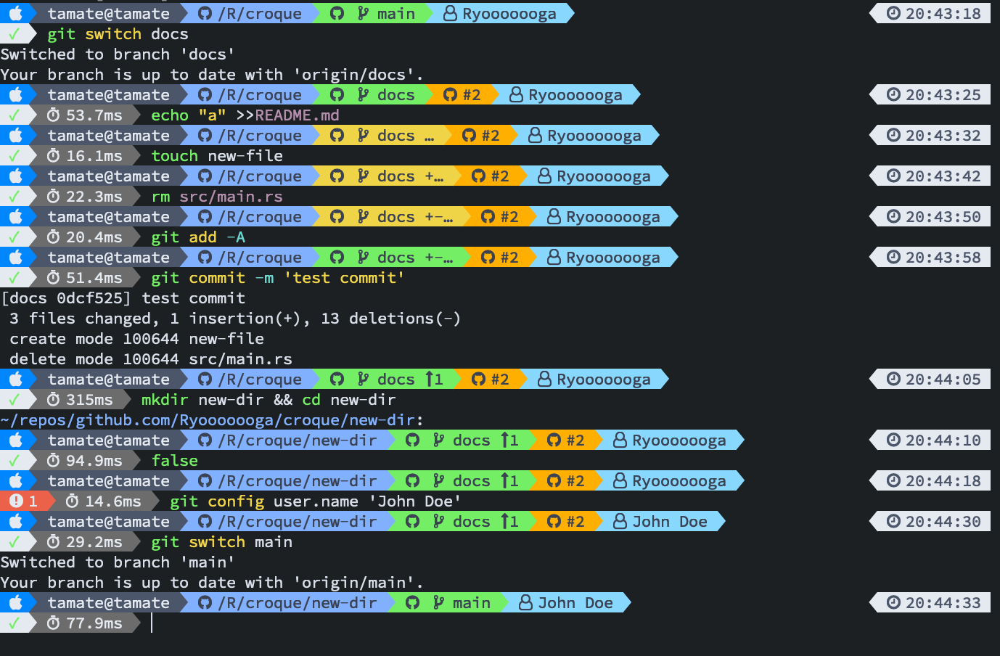

# Croque

[](https://github.com/Ryooooooga/croque/actions)
[](https://crates.io/crates/croque)

Fast and customizable shell prompt.



## Optional Requirements

- [gh](https://github.com/cli/cli)
- [glab](https://docs.gitlab.com/ee/integration/glab)

## Installation

### From source

```sh
cargo install croque
```

### From Homebrew

```sh
brew install ryooooooga/tap/croque
```

### From precompiled binary

[releases](https://github.com/Ryooooooga/croque/releases)

### Bash

```bash
# ~/.bashrc
eval "$(croque init bash)"
```

### Zsh

```zsh
# ~/.zshrc
eval "$(croque init zsh)"
```

#### Using [Zinit](https://github.com/zdharma-continuum/zinit)

```zsh
# .zshrc
zinit light-mode from'gh-r' as'program' for \
    atclone'./croque init zsh >croque.zsh; zcompile croque.zsh' atpull'%atclone' \
    src'croque.zsh' \
    @'Ryooooooga/croque'
```

### Fish

```fish
# ~/.config/fish/config.fish
croque init fish | source
```

## Configuration

```sh
$ croque config > ~/.config/croque/config.yaml
```
